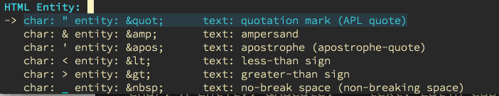

# HTML Entities Helper

Insert from a list of common (and not so common) HTML Entities.

The entity list was originally [scraped from Wikipedia](https://en.wikipedia.org/wiki/List_of_XML_and_HTML_character_entity_references)

# Licence

GNU/GPL

# Contributing

Please submit a pull request, or open an issue on the github repo.

https://github.com/emacsfodder/html-entities-helper
